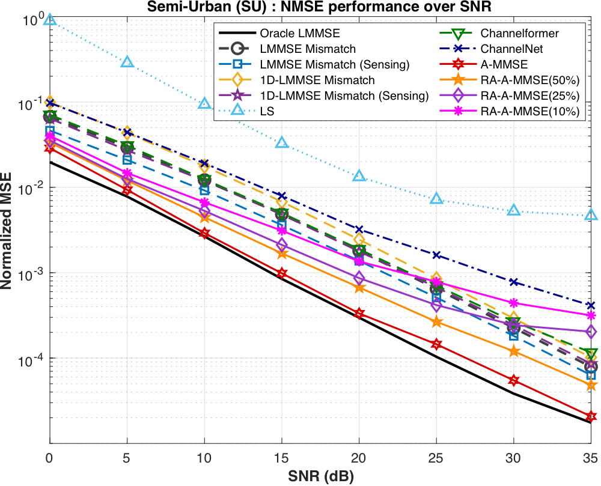
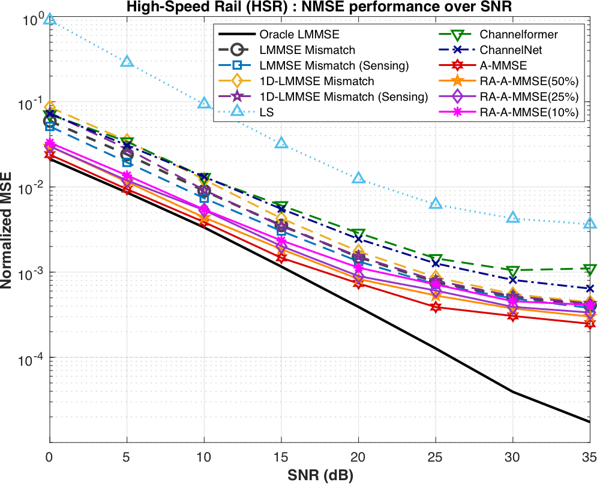

# Learning MMSE Filters for OFDM Channel Estimation: Attention Transformer Gains at Linear Inference

[](https://arxiv.org/abs/2506.00452)

Code for **A-MMSE** (Attention-aided MMSE) and its rank-adaptive extension **RA-A-MMSE**.

Paper: [arXiv:2506.00452](https://arxiv.org/abs/2506.00452). Earlier arXiv versions of this paper were titled *Attention-Aided MMSE for OFDM Channel Estimation: Learning Linear Filters with Attention*.

| Semi-Urban (SU) | High-Speed Rail (HSR) |
|:---:|:---:|
|  |  |

## Abstract

In orthogonal frequency division multiplexing (OFDM), accurate channel estimation is crucial. Classical signal processing-based approaches, such as linear minimum mean-squared error (LMMSE) estimation, often require second-order statistics that are difficult to obtain in practice. Recent deep neural network (DNN)-based methods have been introduced to address this, but they often suffer from high inference complexity. This paper proposes an Attention-aided MMSE (A-MMSE), a model-based DNN framework that learns the linear MMSE filter via the Attention Transformer. Once trained, the A-MMSE performs channel estimation through a single linear operation, eliminating nonlinear activations during inference and thus reducing computational complexity. To improve the learning efficiency of the A-MMSE, we develop a two-stage Attention encoder that captures the frequency and temporal correlation structure of OFDM channels. We also introduce a rank-adaptive extension that adjusts the filter rank at deployment time, enabling efficient operation under resource-constrained receivers. Numerical simulations show that A-MMSE consistently outperforms baseline methods across a wide range of signal-to-noise ratio (SNR) conditions. In particular, the A-MMSE and its rank-adaptive extension provide an improved performance-complexity trade-off.

## How it works

- **Training.** A two-stage attention encoder (frequency, then temporal) and a residual fully connected decoder generate one linear filter `W_AMMSE` of size `NM x L` from the training data.
- **Inference.** Channel estimation is a single matrix-vector product, `vec(H_hat) = W_AMMSE y_p`, where `y_p` holds the `L` pilot observations.
- **Rank adaptation.** RA-A-MMSE reduces the rank of the trained filter to `r`. The receiver stores `A` (`NM x r`) and `B` (`L x r`) and computes `A (B^T y_p)`.

## Repository layout

```
A-MMSE/
  main.py       train A-MMSE, save the filter and the test predictions
  train_ra.py   train the RA module on a saved A-MMSE filter, save (A, B)
  AMMSE.py      model: two-stage attention encoder, residual FC decoder, loss
  data.py       data loading, train/val/test split, DM-RS pilot indices
Results/        figures: COST2100, TDL, SNR mismatch, online adaptation
```

## Requirements

Python 3 with TensorFlow 2, NumPy, SciPy and scikit-learn.

The code uses the Keras 2 API. TensorFlow 2.15 or older works as is. TensorFlow 2.16 or newer ships Keras 3, so install `tf_keras` as well; the scripts set `TF_USE_LEGACY_KERAS=1` themselves.

```bash
pip install tensorflow tf_keras numpy scipy scikit-learn
```

## Data

The datasets are not included. Each run needs two `.mat` files, each holding an array of shape `(72, 14, frames)` (subcarriers x OFDM symbols x frames):

- the true channels, and
- the noisy observations at the training SNR.

Set the file paths and variable names at the top of `A-MMSE/data.py`:

```python
CLEAN_PATH = ""   # .mat file with the true channels
CLEAN_VAR = ""    # variable name in CLEAN_PATH
NOISY_PATH = ""   # .mat file with the noisy observations at the training SNR
NOISY_VAR = ""    # variable name in NOISY_PATH
```

**Split.** The last 4,000 frames in time are the test set, 4,000 frames drawn at random from the earlier frames are the validation set, and the rest is the training set. With the 44,000 frames per scenario used in the paper, this gives 36,000 / 4,000 / 4,000. The counts are arguments of `load_channel(num_val, num_test)`.

**Pilots.** 5G NR Type-A DM-RS with a comb-2 pattern on OFDM symbols 2 and 11 (0-based) over 6 resource blocks, i.e. `L = 72` pilots on the `72 x 14` grid. Pilot symbols are one, so the noisy grid at the pilot positions is `y_p`.

## Training A-MMSE

```bash
cd A-MMSE
CUDA_VISIBLE_DEVICES=0 python main.py
```

The model is trained with the MSE loss and the Adam optimizer (learning rate 1.5e-4, batch size 50, up to 150 epochs with early stopping). Hyperparameters are the constants at the top of `main.py`. One model is trained per training SNR, i.e. per noisy data file.

The script writes two files to `A-MMSE/AMMSE_revision_mse/` (the file names are set in `main.py`):

| File | Variable | Content |
|---|---|---|
| `global_filter_*.mat` | `global_filter` | The trained filter as a real array `(1, 2, L, NM)`: real and imaginary parts. `W_AMMSE = (g[0,0] + 1j*g[0,1]).T` has shape `(NM, L)`. |
| `AMMSE_pred_*.mat` | `transformer_outputs` | Channel estimates of the test frames, `(NM, 1, N_test)`. |

The NMSE printed at the end of `main.py` is a sanity check. The reported values are obtained by applying the saved filter to the pilot observations of the test frames and taking the ratio of the summed squared error to the summed channel energy.

## Training RA-A-MMSE

The A-MMSE is trained once and is not retrained for any rank. For each rank `r` to be offered, only the RA module is trained, with the A-MMSE filter held fixed:

1. The RA module consists of `S` cascaded pairs of real matrices `U_s, V_s` of size `L x r_s`, with `r_1 >= ... >= r_S = r`, and the filter becomes `W_RA = W_AMMSE U_1 V_1^T ... U_S V_S^T` (rank at most `r`).
2. The pairs are trained with the same loss and the same train/validation split as the A-MMSE.
3. `W_RA` is factorized once as `A B^T` with `A` of size `NM x r` and `B` of size `L x r`.
4. At deployment the receiver computes `y~ = B^T y_p` and then `h_hat = A y~`.

```bash
cd A-MMSE
CUDA_VISIBLE_DEVICES=0 python train_ra.py \
    --w_ammse AMMSE_revision_mse/<global_filter>.mat \
    --ranks <r_1 ... r_S> \
    --lr <learning rate> --epochs <epochs> --batch_size <batch size> --patience <patience> \
    --out <ra_filter>.mat
```

- `--ranks` accepts any integers with `L >= r_1 >= ... >= r_S >= 1` (`L = 72` here). One value trains a single pair; several values train cascaded pairs. The last value is the rank of the deployed filter.
- The output file holds `A`, `B` (complex64) and `ranks`. The script also prints the test NMSE of the full-rank filter and of the rank-`r` filter, the latter computed with the two-step product above.
- The paper reports the 50%, 25% and 10% rank configurations, `r = 36, 18, 7`, trained with `S = 1, 2, 3` pairs.

## Filter modes

`main.py` uses the global-token mode by default (`USE_TRANSFORMER_GLOBAL_FILTER = True`): a trainable token is passed through the network and produces one filter for all samples. `AMMSE.py` also contains the alternatives below.

| Mode | How to enable |
|---|---|
| Directly trainable shared filter | `USE_TRAINABLE_SHARED_FILTER = True` in `main.py` |
| Per-sample filter, batch-mean filter, or one precomputed filter | `set_sharing_mode(0)`, `(1)`, `(2)` |
| Blend of a shared filter and the per-sample filter | `enable_hybrid_blend()` |

The model checks them in this order: global token, hybrid blend, sharing mode.

## Results

| Experiment | Folder |
|---|---|
| NMSE vs. SNR on COST2100 (SU, HSR): A-MMSE, RA-A-MMSE and baselines | [`Results/COST2100/`](Results/COST2100/) |
| SNR mismatch on COST2100: filters trained at 0, 20, 35 dB | [`Results/COST2100/SNR_mismatch/`](Results/COST2100/SNR_mismatch/) |
| NMSE vs. SNR on 3GPP TDL-A to TDL-E | [`Results/TDL/`](Results/TDL/) |
| SNR mismatch on TDL: filters trained at 0, 15, 30 dB | [`Results/TDL/SNR_mismatch/`](Results/TDL/SNR_mismatch/) |
| Online adaptation when the channel switches from TDL-D to TDL-E | [`Results/TDL/Online/`](Results/TDL/Online/) |

## Citation

```bibtex
@misc{ha2026learningmmsefiltersofdm,
      title={Learning MMSE Filters for OFDM Channel Estimation: Attention Transformer Gains at Linear Inference}, 
      author={TaeJun Ha and Chaehyun Jung and Hyeonuk Kim and Jeongwoo Park and Jeonghun Park},
      year={2026},
      eprint={2506.00452},
      archivePrefix={arXiv},
      primaryClass={eess.SP},
      url={https://arxiv.org/abs/2506.00452}, 
}
```
