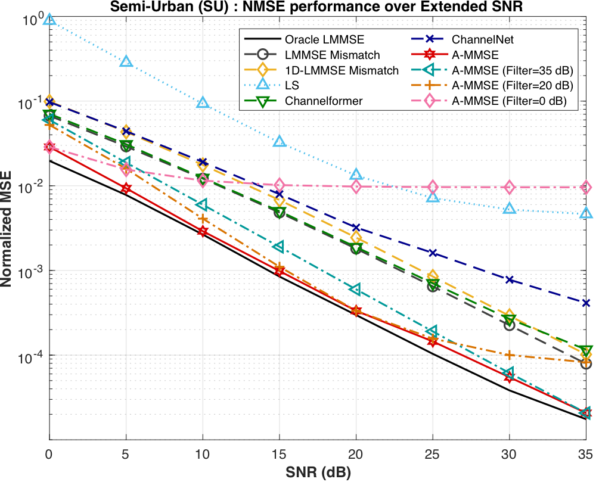
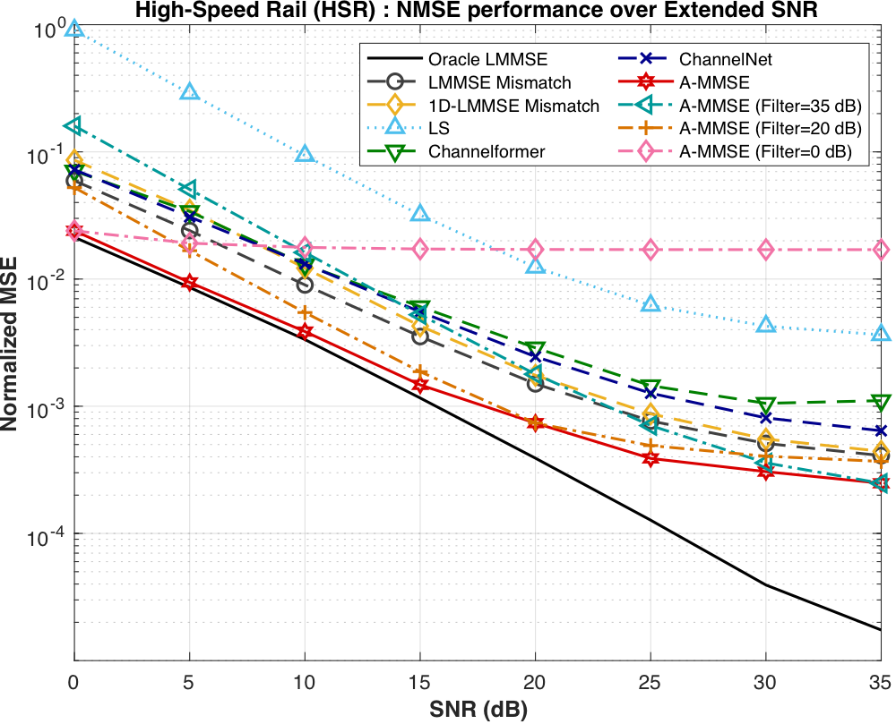

# SNR mismatch on COST2100

A-MMSE filters trained at a single SNR (0, 20 or 35 dB) and applied over the whole 0-35 dB range. In the figures, "A-MMSE" is the matched case (a filter trained at each test SNR) and "A-MMSE (Filter=x dB)" is the filter trained at x dB.

| Semi-Urban (SU) | High-Speed Rail (HSR) |
|:---:|:---:|
|  |  |
| [NMSE_SU_EX.pdf](NMSE_SU_EX.pdf) | [NMSE_HSR_EX.pdf](NMSE_HSR_EX.pdf) |

- **Trained at 0 dB.** The filter reaches an error floor at high SNR. In SU its NMSE at 35 dB is 9.6e-3, about 460 times that of the matched filter.
- **Trained at 35 dB.** The filter degrades at low SNR. In HSR its NMSE at 0 dB is 0.16, against 0.024 for the matched filter.
- **Trained at 20 dB.** The most robust of the three. In HSR it stays within a factor of 1.5 of the matched filter at 35 dB.

A-MMSE is most robust when the training SNR balances the noise and the clean channel components.
