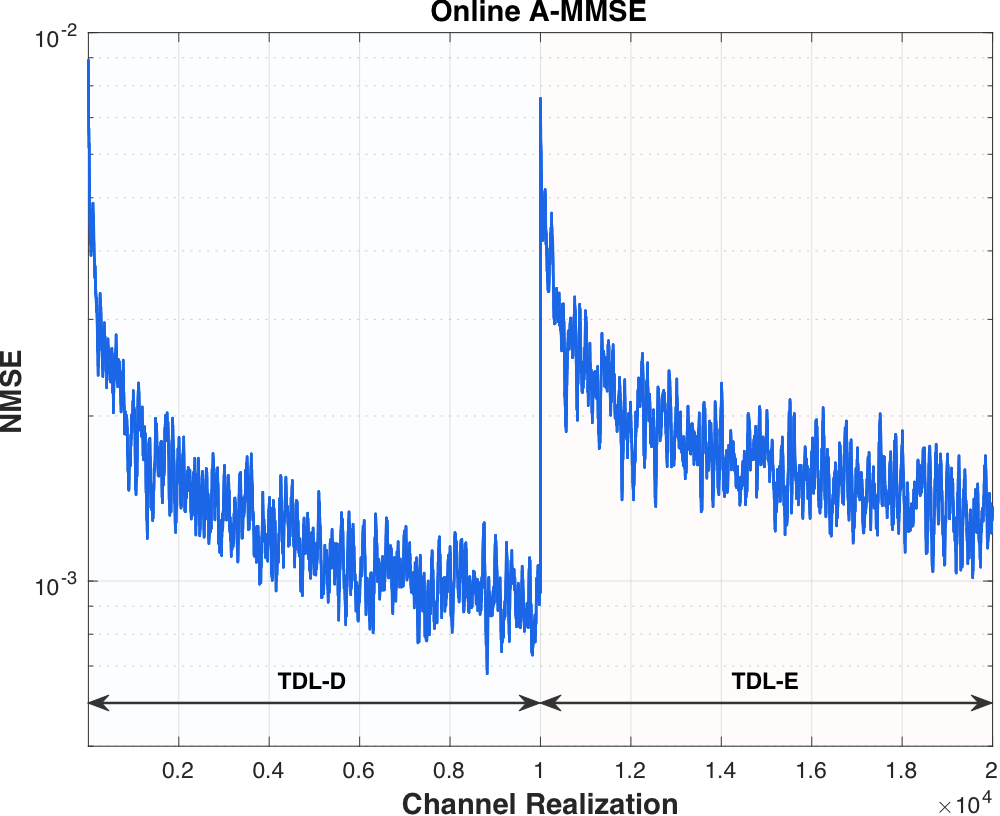

# Online A-MMSE

NMSE of the online A-MMSE while the channel model switches from TDL-D to TDL-E. The filter is updated online and has no prior knowledge of the new channel.

[Online_result.pdf](Online_result.pdf)

- 20,000 channel realizations: the first 10,000 from TDL-D, the next 10,000 from TDL-E. The SNR is fixed.
- Under TDL-D the NMSE decreases steadily to about 1e-3.
- At realization 10,000 the channel switches to TDL-E and the NMSE jumps back to almost 1e-2.
- The filter then adapts to TDL-E and the NMSE decreases again.
