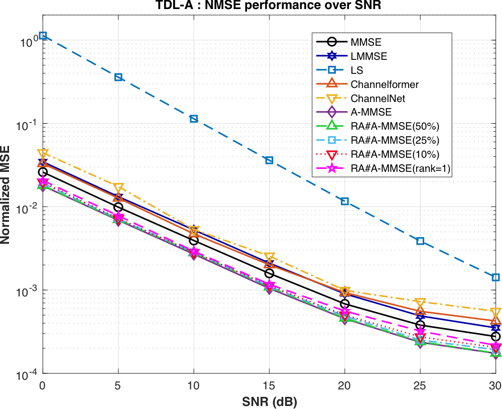
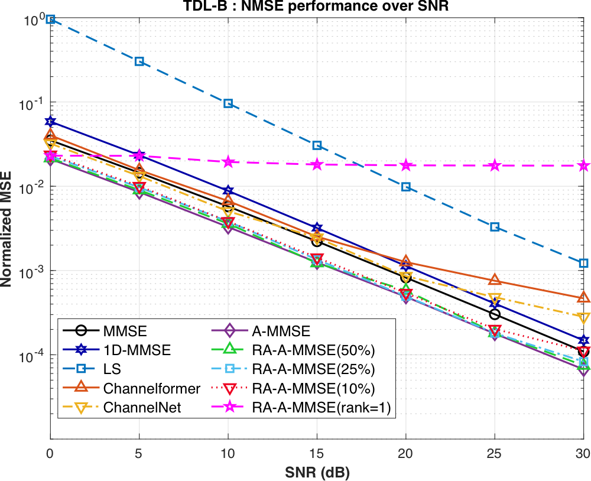
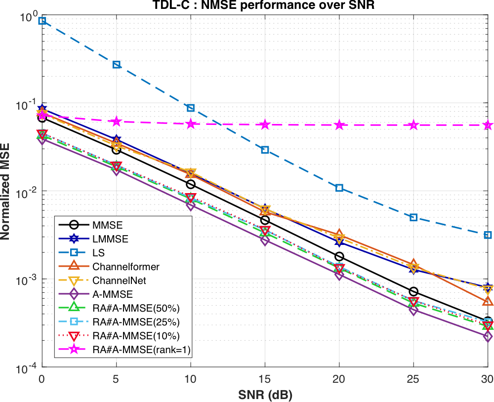
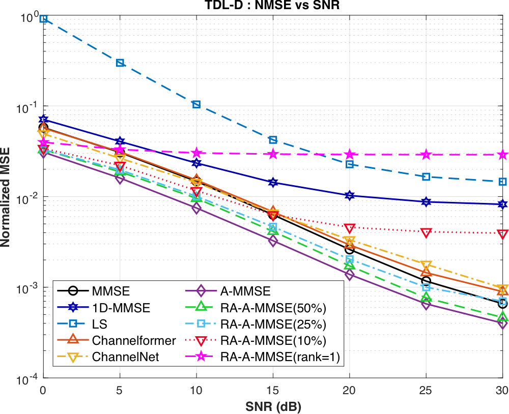
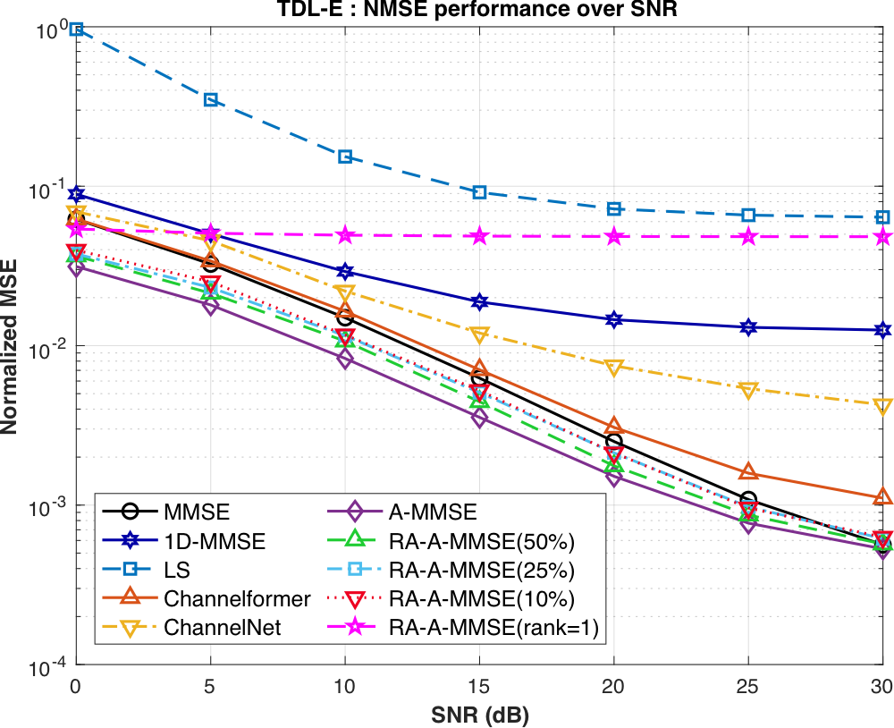

# TDL results

NMSE versus SNR on the 3GPP tapped delay line (TDL) channel models. TDL-A, TDL-B and TDL-C are NLOS profiles; TDL-D and TDL-E are LOS profiles.

The figures compare A-MMSE and RA-A-MMSE (50%, 25%, 10% rank and rank 1) with LS, MMSE, 1D-MMSE, ChannelNet and Channelformer. A-MMSE outperforms the baselines on all five channel models.

| TDL-A | TDL-B | TDL-C |
|:---:|:---:|:---:|
|  |  |  |
| [TDLA_SNR.pdf](TDLA_SNR.pdf) | [TDLB_SNR.pdf](TDLB_SNR.pdf) | [TDLC_SNR.pdf](TDLC_SNR.pdf) |

| TDL-D | TDL-E |
|:---:|:---:|
|  |  |
| [TDLD_SNR.pdf](TDLD_SNR.pdf) | [TDLE_SNR.pdf](TDLE_SNR.pdf) |

More results:

- SNR mismatch (filters trained at 0, 15, 30 dB): [`SNR_mismatch/`](SNR_mismatch/)
- Online adaptation when the channel switches from TDL-D to TDL-E: [`Online/`](Online/)
