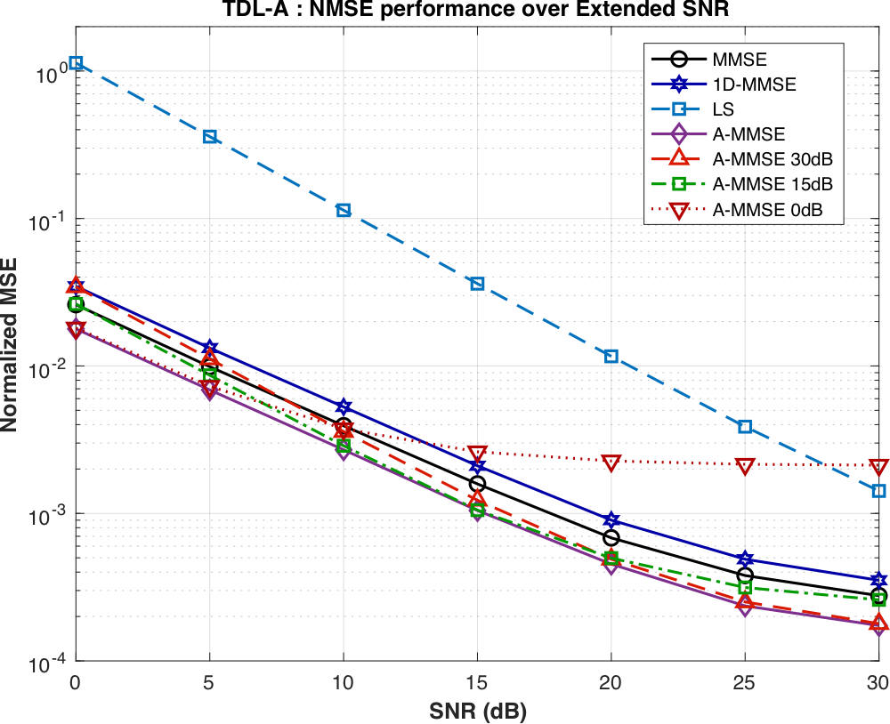
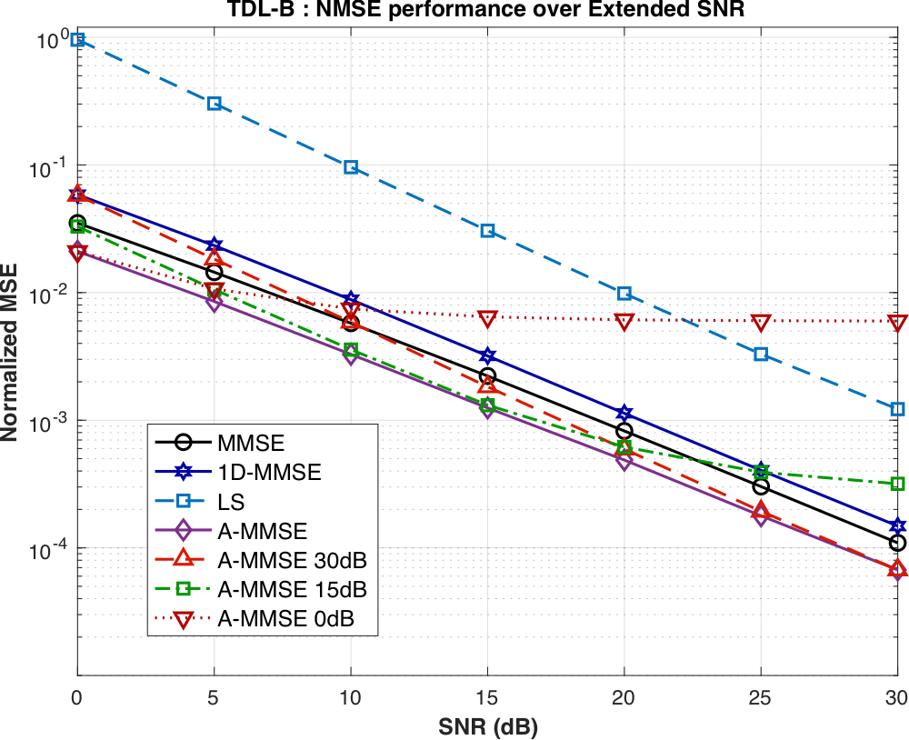
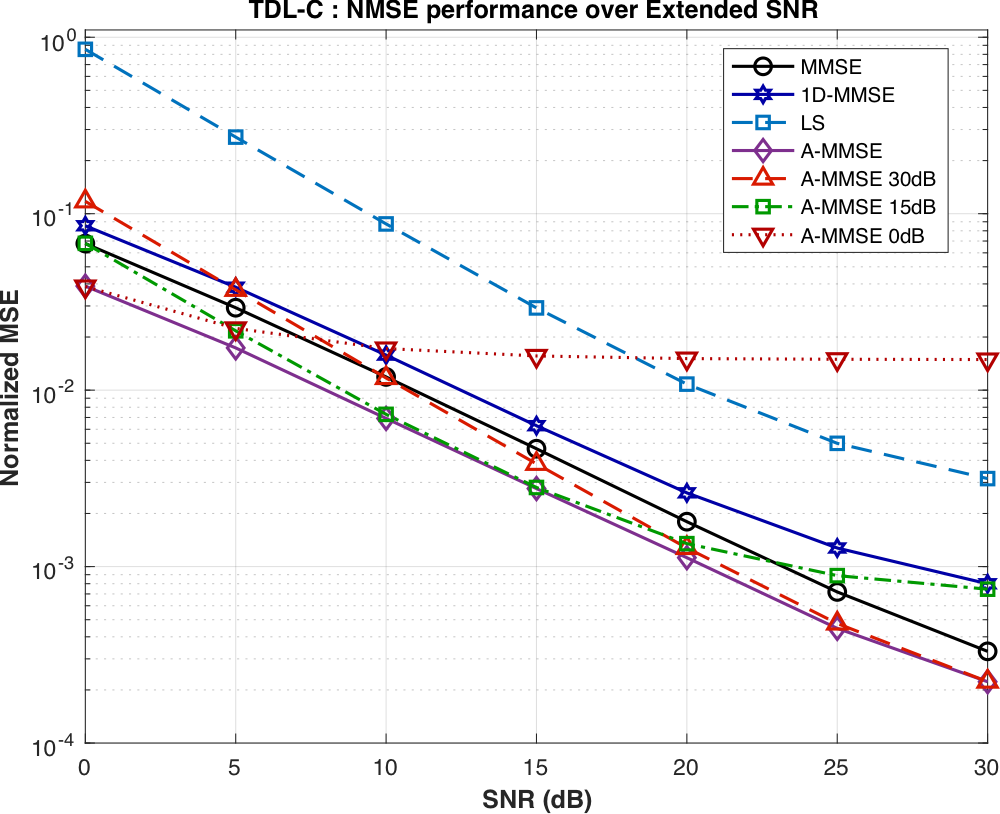
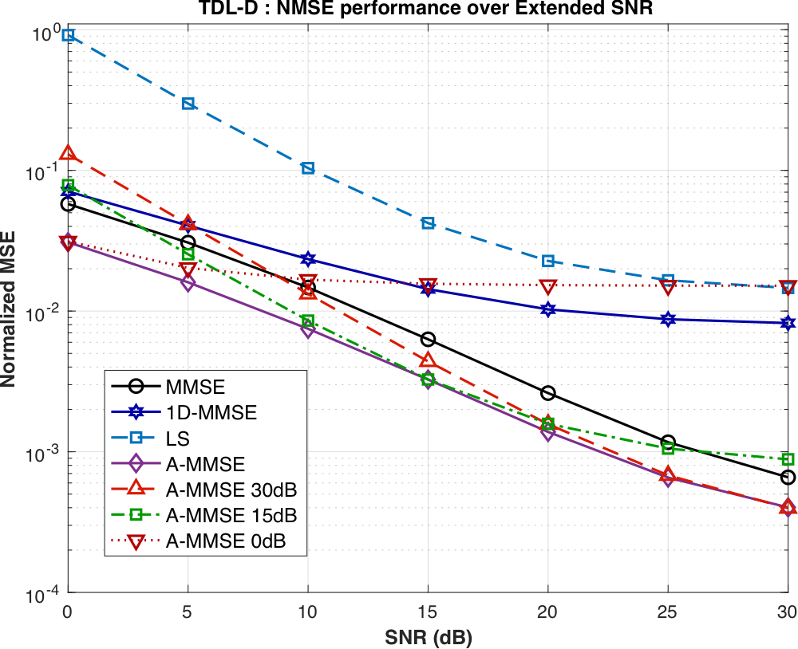
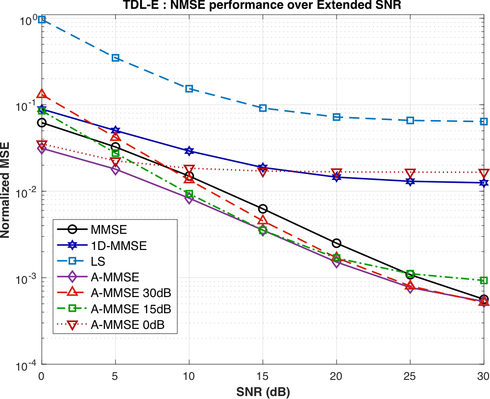

# SNR mismatch on TDL channels

A-MMSE filters trained at a single SNR (0, 15 or 30 dB) and applied over the whole 0-30 dB range on the 3GPP TDL-A to TDL-E channels. In the figures, "A-MMSE" is the matched case (a filter trained at each test SNR) and "A-MMSE x dB" is the filter trained at x dB.

| TDL-A | TDL-B | TDL-C |
|:---:|:---:|:---:|
|  |  |  |
| [TDLA_EX.pdf](TDLA_EX.pdf) | [TDLB_EX.pdf](TDLB_EX.pdf) | [TDLC_EX.pdf](TDLC_EX.pdf) |

| TDL-D | TDL-E |
|:---:|:---:|
|  |  |
| [TDLD_EX.pdf](TDLD_EX.pdf) | [TDLE_EX.pdf](TDLE_EX.pdf) |

The trend is the same as on COST2100 ([`../../COST2100/SNR_mismatch/`](../../COST2100/SNR_mismatch/)): the filter trained at 0 dB reaches an error floor at high SNR, the filter trained at 30 dB loses accuracy at low SNR, and the filter trained at 15 dB is close to the matched filter around its training SNR and moves away from it toward both ends of the range.
